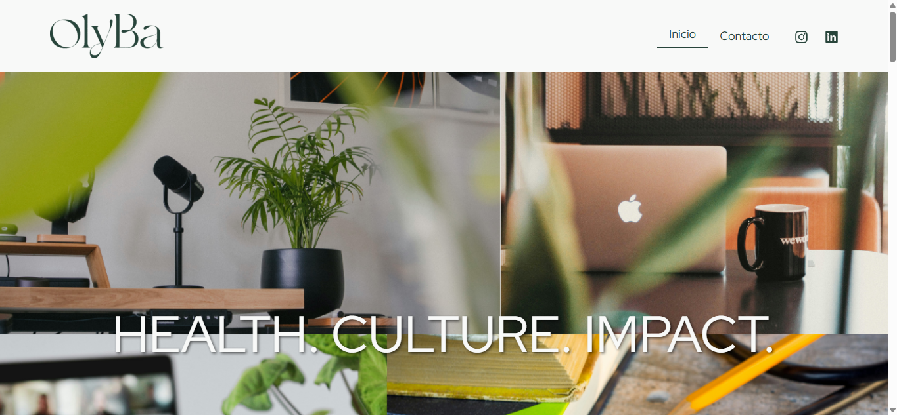
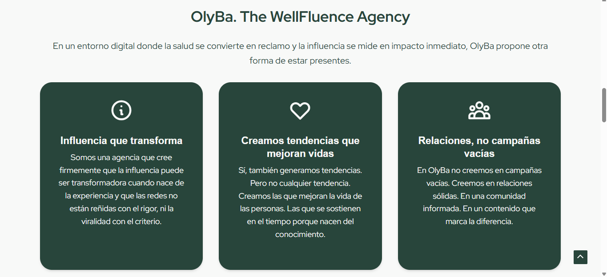
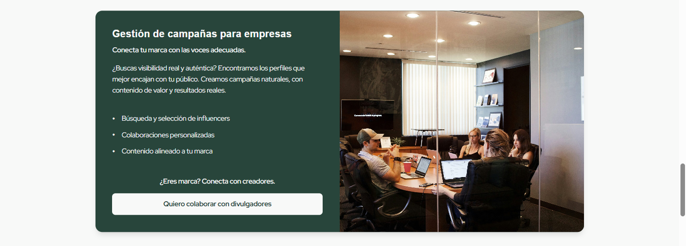
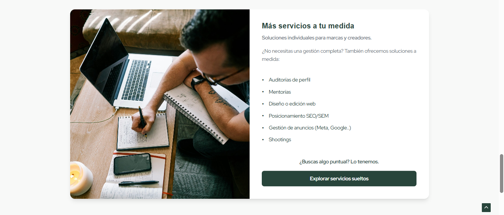
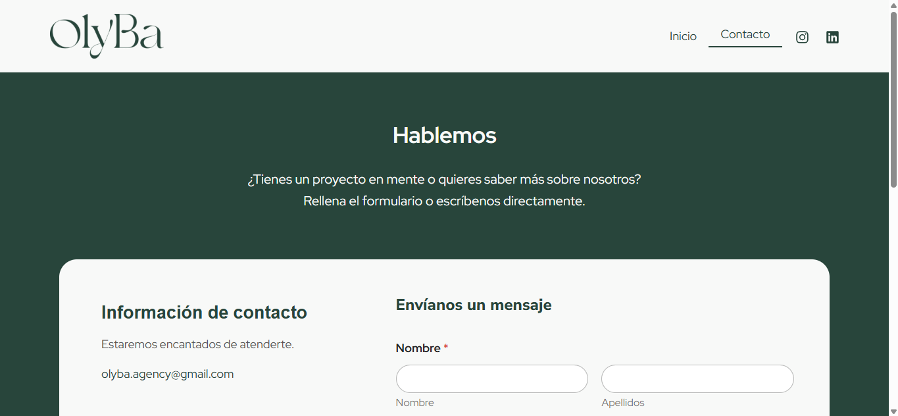
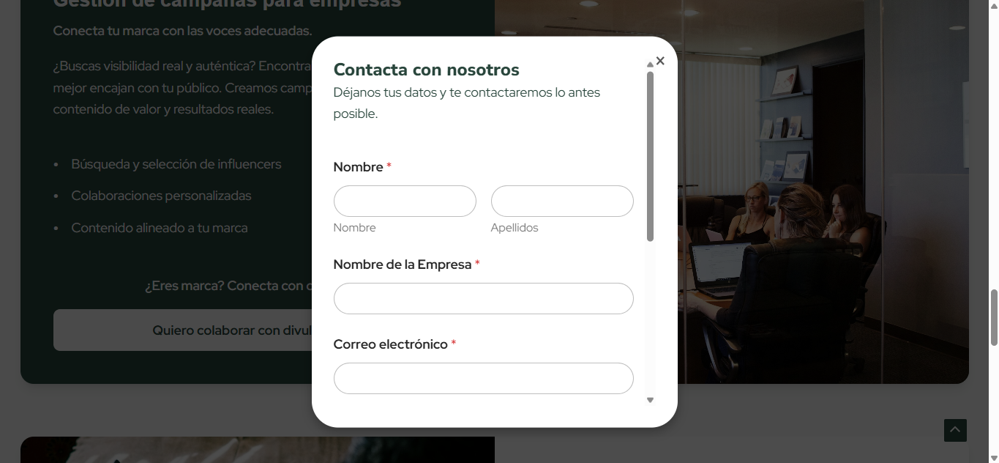

# Olyba Agency - Web Oficial (En Desarrollo)

**Autores:** 
Juan-Carlos-dev
AlejandroHernanCid

## Descripción del Proyecto

Este repositorio contiene las **capturas de pantalla** de la página web de Olyba, una agencia de representación de profesionales de la salud e influencers.

El objetivo de este proyecto es demostrar mi progreso en el diseño y desarrollo de una plataforma profesional con énfasis en:
* Diseño visual limpio y enfocado en la **confianza** y el **propósito**.
* Estructura clara de los **servicios** ofrecidos.
* **Diseño responsive** y formularios de contacto funcionales.

*Nota: El código de este proyecto es propiedad intelectual de un cliente, por lo que no puede ser publicado en este repositorio. Este espacio se utiliza exclusivamente para mostrar mis habilidades de Diseño UX/UI y Desarrollo Front-end a través de las capturas de pantalla del sitio final.*

## Vistas Previas del Diseño

### 1. Cabecera y Sección Principal

La primera impresión de la agencia, destacando su foco en "HEALTH. CULTURE. IMPACT." y el menú principal.

### 2. Sobre Nosotros

Detalle de la sección "Sobre OlyBa", resaltando el trabajo con **expertos capaces de transformar su experiencia y conocimiento** en contenido útil y cercano.

### 3. Introducción y Valores

Sección que explica la misión de Olyba: "The WellFluence Agency", con un enfoque en la **influencia que transforma** y la creación de **tendencias que mejoran vidas**.

### 4. Gestión de Talento para Influencers

Explicación de los servicios de representación profesional para creadores de contenido, incluyendo **asesoría de imagen digital** y **estrategia de crecimiento**.

### 5. Gestión de Campañas para Empresas

Descripción de cómo Olyba ayuda a las empresas a **conectar con voces adecuadas** para campañas auténticas y con resultados reales.

### 6. Servicios Adicionales (A la Medida)

Una lista de servicios extra ofrecidos por la agencia, como **auditorías de perfil**, **mentorías**, **diseño web** y **posicionamiento SEO/SEM**.

### 7. Formulario de Contacto (Página Principal)

Diseño de la sección de contacto en la página principal, invitando al usuario a rellenar un formulario o contactar por correo (`olyba.agency@gmail.com`).

### 8. Pop-up de Contacto Rápido

El formulario de contacto que aparece en formato **pop-up** para una interacción rápida y directa con el usuario.

### 9. Cierre y Call to Action

La sección final de la web, con una llamada a la acción clara (**"Solicitar una reunión gratuita"**) y el pie de página con el aviso legal.

-------------------------------------------------------------------------------------------------------------------------------------------------------------------------------------------

## Tecnologías Previstas

* **Plataforma / CMS:** WordPress.
* **Alojamiento:** Hostinger.
* **Lenguajes Base:** HTML5, CSS3, JavaScript (usados para la personalización y desarrollo del tema/plantilla).
